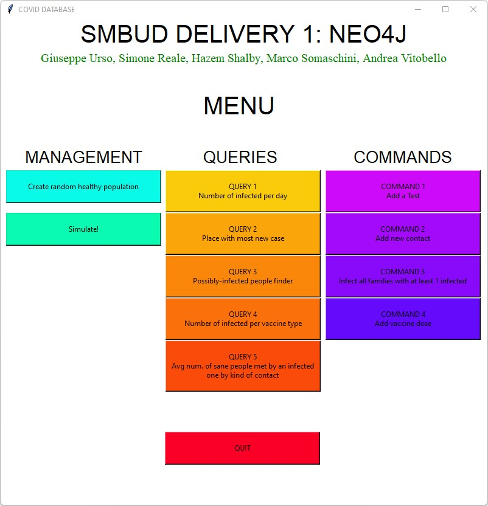
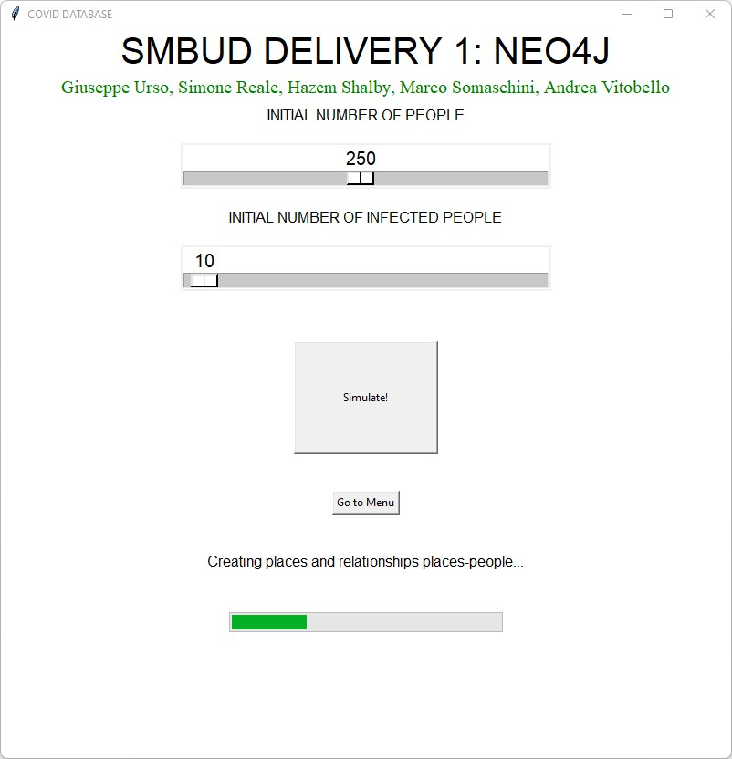
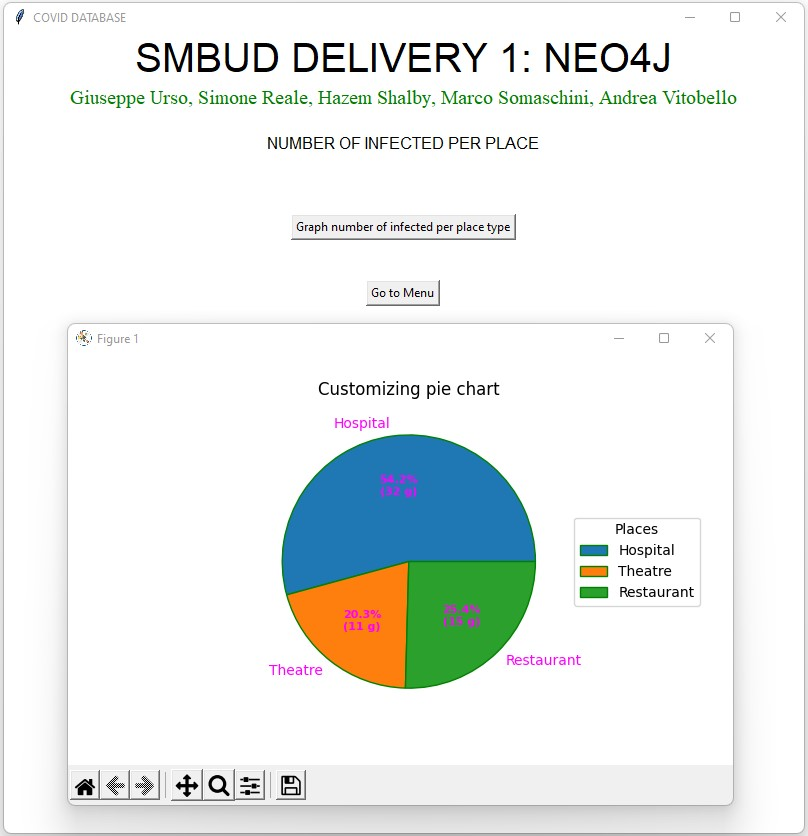

  
   
  <i>
  	Systems and Methods for Big and Unstructured Data - Delivery #1 - AA 2021/2022 - Prof. Marco Brambilla
  </i>

<h1 align="center">
	<strong>
	COVID Information System Utility
	</strong>
	 
</h1>

		
		
		 			
		<a href="https://neo4j.com/">Neo4j</a>		 
		•		
		<a href="report/report.pdf">Report</a>   
	

A GUI application that implements an information system about the COVID pandemic, using the graph-based database technology by Neo4j. 

## Features
* **Simulate** the infection spread and create a realistic dataset
* **Analyse** and automatically retrieve info like:
    * Number of new infection per day
    * People potentially at risk of contagion
    * Efficacy of vaccines
* **Manage** the database with the integrated commands

## Video Tutorial
Check out the following youtube video to see the application in action!

## Visuals

  

  

  
   

## Authors
*Reale Simone*

*Shalby Hazem*

*Somaschini Marco*

*Urso Giuseppe*

*Vitobello Andrea*
